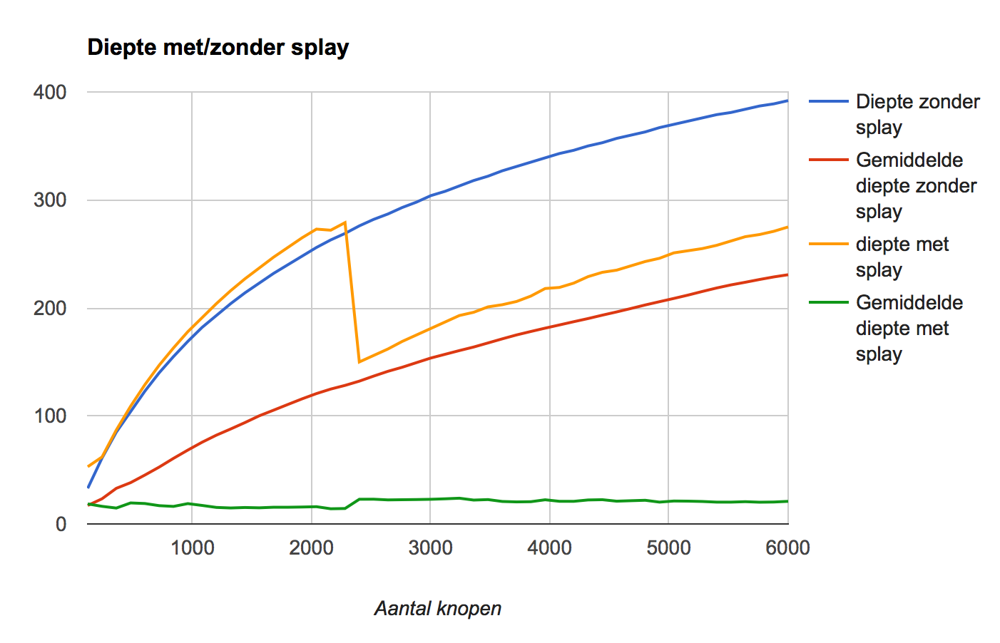

# Splaybomen

Soms is het interessant om grafiekjes te kunnen bekijken. We laten uiteraard het eigenlijke werk, het tekenen van de grafiek, over aan iemand anders, en gebruiken een spreadsheet. Een voorbeeldje vind je in het programma zoekboomdiepte_Cpp11.cpp, dat de header puntgenerator.h gebruikt. Dit maakt een grafiek (wat die betekent zien we later) en slaat deze op in een bestand dieptedata.csv. Als je het programma laat lopen en dan dieptedata.csv inleest in je favoriete spreadsheet, zoals Excel of OpenOffice Calc, dan kan je met de diagramfunctie een grafiekje tekenen. Opmerking: dieptedata.csv is geschikt voor rekenbladprogramma's met een niet-Engelstalige instelling, waarbij vlottendekommagetallen worden voorgesteld met een vlottende komma. Hoe je een .csv-bestand produceert waar de vlottende komma vervangen is door een punt, vind je in de API van de klasse CsvData:

De klasse CsvData wordt gedefinieerd in de header csv.h Elk object van de klasse komt overeen met één .csv-bestand, waarin getalwaarden worden opgeslagen. Vermits de meeste rekenbladen grafieken kunnen opmaken met verschillende gegevensreeksen, waarbij elke gegevensreeks standaard opgeslagen is in een kolom, slaat elke CsvData gegevens ook op deze manier op. De API is de volgende
CvsData(const std::string& _bestandsnaam, char _scheidingsteken='.')
Creëert een CsvDataobject._scheidingsteken duidt aan welk teken geheel en fractioneel deel scheidt in een vlottendekommagetal. Defaultwaarde is '.'; voor niet-Engelse rekenbladen dient ',' opgegeven te worden.
template class<class T>
voegDataToe(const std::vector<T>& nieuwedata)
Voeg een kolom met numerieke waarden toe. T kan een willekeurig type zijn dat met static_cast<double> kan worden omgezet naar double.

Bij splayen probeer je de boom zo te herordenen dat operaties gemiddeld efficiënt zijn. Interessant is hierbij de gemiddelde diepte van een knoop te kennen. Schrijf een lidfunctie van Binboom die de gemiddelde diepte van de knopen berekent.

Een naïeve methode om te splayen is de volgende:

    Vertrek bij de binboom met een een pointer naar de wortel.
    Als je in een lege boom zit, of in de boom waarvan de wortel de gezochte sleutel heeft, stop.
    Als de gezochte sleutel kleiner is dan de sleutel in de wortel, roteer naar rechts.
    Als de gezochte sleutel daarmee naar rechts geroteerd is ga naar de rechter deelboom.
    Als de gezochte sleutel groter is dan de sleutel in de wortel, roteer naar links.
    Als de gezochte sleutel daarmee naar links geroteerd is ga naar de linker deelboom.
    Ga terug naar stap 2.

Maak nu een zoekboom die getallen kan bevatten en voeg de getallen van 0 tot en zonder 10000 in volgorde toe.

Pas nu de bovenstaande naïeve splaymethode toe op 10000 random gekozen getallen die in de boom zitten. Neemt de gemiddelde diepte van de knopen systematisch af?

Doe nu hetzelfde, maar met een nieuwe boom waarin dezelfde getallen in random volgorde zijn toegevoegd.
